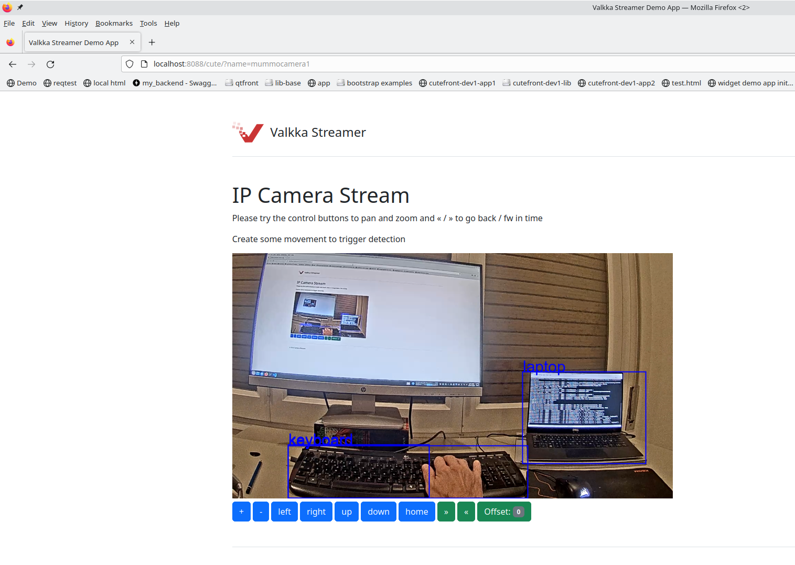

# Valkka Streamer



*Valkka Streamer is a python- and web-based IP camera streamer and analysis framework sponsored & brought to you by* [XactAI](http://www.xactai.com/) !

It uses [libValkka](https://elsampsa.github.io/valkka-examples/_build/html/index.html) to manage IP cameras and analyzer processes.

With Valkka Streamer you can:

- Analyze 20+ IP cameras on commodity hardware
- Include your custom machine vision analyzers
- Send low-latency live-stream and live results to a web-browser via websockets
- Use a single shared "heavy" analyzer for several cameras (e.g. yolo)
- ..while simultaneously using "light" analyzers for classical computer vision tasks

Configuration (cameras, analyzer attachment to streams, logging verbosity, etc.) is done via a single [yaml file](valkka/streamer/data/example.yaml)
(which also serves as documentation).

Valkka Streamer is an example and a template for production projects.  A typical use-case is a server doing 24/7 AI / machine vision analysis in a server room connected to a large amount of IP cameras (and NVRs), while simultaneously writing results into a database and offering live streams and results via a web-interface.

Valkka Streamer's architecture is modular: implementing custom analyzers as plug-in modules into Valkka Streamer is easy and are placed in their respective subdirectories under [valkka/streamer/analyzers](valkka/streamer/analyzers)


## Install

*Install some required libraries*
```
sudo apt-get install nginx
sudo systemctl disable nginx
```

*Install libValkka* as described in [here](https://elsampsa.github.io/valkka-examples/_build/html/requirements.html)

Install *this* python package
```
pip3 install -e .
```

*Install Ultralytics Yolo*

Valkka Streamer is framework agnostic when it comes to using deep-learning frameworks (tensorflow, pytorch, you name it).  Here, for demo purposes only, we use [Ultralytics YoloV8](https://docs.ultralytics.com/).  You can install it with:
```
pip install ultralytics
```
Before that you might (or might not) need to install a correct version of pytorch to your system.

You can quick-test your yolo installation with:
```
from ultralytics import YOLO
from valkka.streamer.tools import getDataFile
YOLO(getDataFile('yolov8n.pt')) # uses the .pt file from the correct place
model("/path/to/some/image.jpg")
# import numpy as np
# model(np.random.randint(0,255,size=(640,640,3))) # or with this if you don't have an image at hand
```
Please be aware of ultralytic's licensing terms

## Usage

```
valkka-streamer --yaml=path/to/your/yaml/file
```

If no yaml file is defined, the [default yaml file](valkka/streamer/data/example.yaml) is used.

Get a template for your config file with:
```
curl https://raw.githubusercontent.com/elsampsa/valkka-streamer/main/valkka/streamer/data/example.yaml --output myconfig.yaml
```

To terminate the (interactive) program, just press ``CTRL-C``.

Valkka Streamer is a stand-alone/all-in-one example and it uses nginx
as the reverse-proxy server to serve websockets.  After starting the program, you can view the live stream and analysis results
in [here](http://localhost:8088/basic?name=mummocamera1):
```
http://localhost:8088/basic?name=CAMERANAME
```
where ``CAMERANAME`` is name of a camera/stream you have defined in the [input file](valkka/streamer/data/example.yaml).

Take a look at the web frontend js code in [here](valkka/streamer/data/basic/index.html).

For a fancier web-frontend (using [CuteFront frontend framework](https://elsampsa.github.io/cutefront/_build/html/index.html)) 
with digital pan, zoom and interactive time control, go [here](http://localhost:8088/cute?name=mummocamera1):
```
http://localhost:8088/cute?name=CAMERANAME
```
That web frontend js code can be found [here](valkka/streamer/data/cute/index.html).

*If you encounter problems in viewing the live stream, the first thing is to toggle the web developer tools to see the console output.*

If the program crashes (probably your fault), remember to run this command:
```
killall -9 valkka-streamer nginx
```
so that no multiprocesses are left dangling & messing up your next tryout.

If you get
```
nginx: [emerg] bind() to 0.0.0.0:8088 failed (98: Address already in use)
```
change the nginx port in the configuration yaml file.


## For developers

Instead of a "microservice" architecture, Valkka Streamer uses [multiprocessing architecture](https://elsampsa.github.io/valkka-multiprocess/_build/html/index.html), where multiprocesses have well-defined interfaces for intercommunication.

A "Manager" (the main process) instantiates and manages all multiprocesses and establishes intercommunication
channels between them

### Multiprocess architecture at a glance
```
Manager
    path: main.py
    instantiates libValkka filterchains
    receives messages from (1-4)

    1. AnalyzerProcess (test_1)
        path: analyzers/test_1/main.py
        sends data directly to (4)
        sends messages UP (i.e. to Manager)

    2. AnalyzerProcess (test_2)
        path: analyzers/test_2/main.py
        sends frames directly to (3)
        receives data directly from (3)
        sends data directly to (4)
        sends messages UP

    3. MasterProcess (master_test_1)
        path: analyzers/master_test_1/main.py
        receives data directly from (2)
        sends messages UP

    (any number of Analyzer and Master processes can be instantiated)

    4. MultiServerProcess
        path: multiprocess/multiserver.py
        asyncio architecture
        receives data directly from (1) and (2)
        pushes data through websocket servers
            - live stream as fragmented MP4 (fmp4)
            - results as json messages
        send messages UP
```

### Outlook

To give you food for though, here are some ideas for extending Valkka Streamer:

*Adding message and database clients*

- Add more multiprocesses under Manager, say MQTT client, HTTP client (for connecting to an sql database), etc.

*Saving small (say, 10 s videoclips) as per analyzer event*

- MultiServerProcess caching fmp4
- AnalyzerProcess, upon seeing an event, sending a message to (via Manager) to MultiServerProcess to save the cached fmp4 to a database

*On-demand version*

- Here everything is configured "statically" with a single yaml file
- .. however, consider using this program as a microservice in the backend and intercommunicating with the frontend : you can spin up camera connections and analyzers as per user's request in the web-interface


### Files at a glance
```
valkka/streamer/

    main.py                 # the master process, using the configuration to
                            # create libValkka filterchains (see chain/)
                            # and to orchestrate intercom between multiprocesses

    cli.py                  # program entry-point

    singleton.py            # multiprocessing synchronization primitives

    multiprocess/
        
        rgb.py              # a base class RGB24Process that is able to receive
                            # frames from several libValkka shmem servers

        client.py           # an extension of RGB24Process -> ClientProcess
                            # + an image rgb24 shmem server for sharing
                            # frames with a master process
                            # + data shmem client for receiving
                            # results from a master process
                            # + data shmem server for sending
                            # results to multiserver.py

        master.py           # a base class MasteProcess for a master analyzer that takes
                            # images from client analyzers and responds them with results
                            # typically used by a "heavy" stateless analyzer, such as yolo

        multiserver.py      # a websocket server, receiving streaming video
                            # and results from the analyzer clients
        nginx.py            # a wrapper for a stand-alone nginx 
                            # reverse-proxy server (for demo purposes)

    analyzers/              # subclasses / customizes processes from the 
                            # multiprocess/ folder
        test_1/             # a custom analyzer with a state: movement
        test_2/             # a custom analyzer with a state: upon movement
                            # send frames to master_test_1
        master_test_1/      # a custom master stateless analyzer: receives frames
                            # from client analyzers, passes them through ultralytics yolov8
                            # and responds with results

    chain/
        main.py             # the libValkka main filterchain - one per stream
        rgb.py              # libValkka side filterchain: shared memory server
                            # serving RGB24 frames for analyzer processes

    data/
        example.yaml        # an example (and the default) input file
        basic/
            index.html      # an example web frontend html file with
                            # low-latency live streaming and results
                            # message streaming from the MultiServerProcess
                            # (websocket server)
        cute/
            index.html      # an more fancier web frontend html using
                            # the CuteFront(tm) web frontend framework
```

## FAQ

*Can't see any stream in the browser / browser complains that it can't connect to the websocket*

Please update your ``websockets`` module to the latest one with:
```
pip install -U websockets
```
We use the asyncio version of websockets and asyncio is (still) under constant change as per new python versions.

You can also try to turn off any of the "competing" nginx (or other?) webservers with:
```
sudo systemctl disable nginx
```

And even turn off the ubuntu firewall:
```
sudo ufw disable
```

*Can't see any of those object bounding boxes in the browser*

Please take a carefull look into the program logs - maybe your yolo installation doesn't work, or
your machine is too slow to give detection results fast enough

## License

MIT

## Copyright

(c) Sampsa Riikonen 2023

## Author(s)

Sampsa Riikonen

